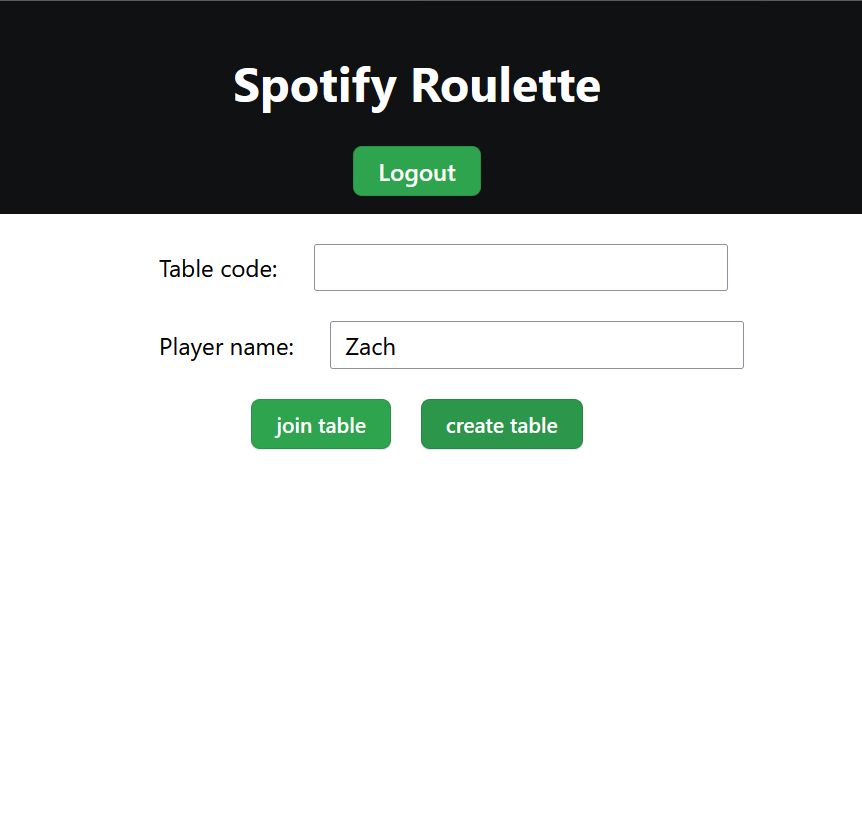
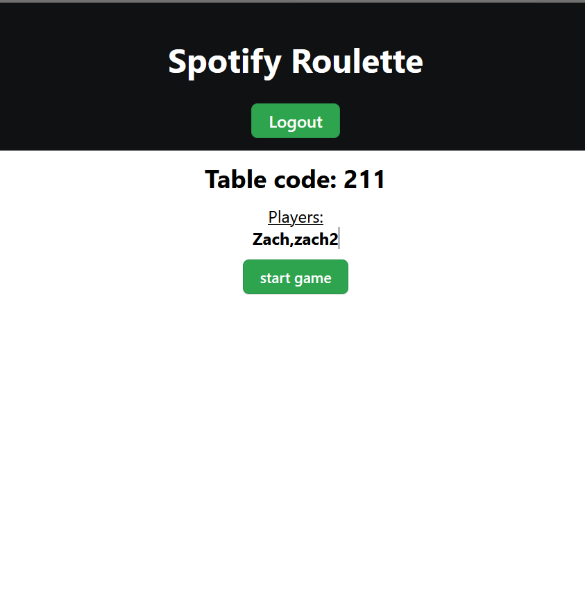
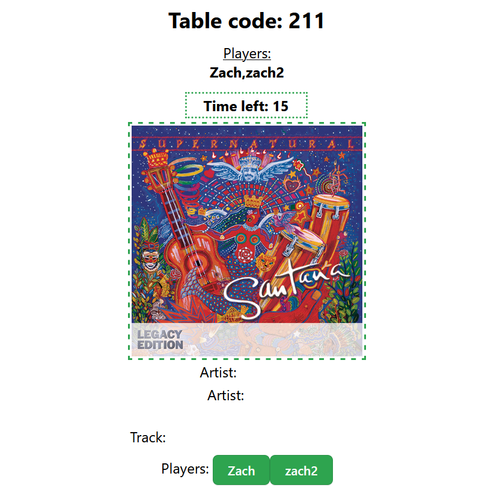
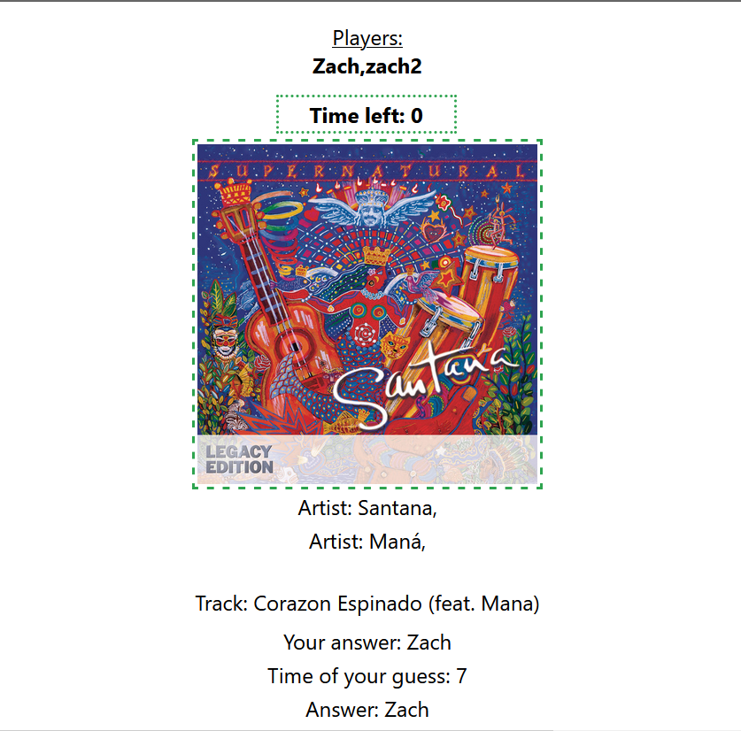

# 🎶 Spotify Roulette

Group Spotify game utilising websockets, where user's guess whose song is whose.

## Premise

users can create 'games', which other users can join, then when the table creator starts the game a random players will be selected and one of their top tracks is distributed amongst the table users. The song will be played for each player and song details will slowly be revealed. Players have to guess who the song 'belongs' to, the time at which the guess is recorded for a higher score.

### Game flow:

Below are (old) screenshots of the game flow,

1. Create and join a game.

    <kbd>
        
    </kbd>
    <kbd>
        
    </kbd>
    <kbd>
        
    </kbd>

2. Playing the game, the details are slowly revealed to aid with guessing while the song plays.

    <kbd>
        
    </kbd>
    <kbd>
        
    </kbd>    
    <kbd>
        
    </kbd>

## Prerequisites:

- `npm`
- Spotify account

## Setup:

- Start backend by:

  - Navigating to server/
  - Running `node index.js`

- Start frontend by:
  - Adding your Spotify developer key to `.env.local`
  - Navigating to frontend/
  - Running npm install
  - Running npm start
  - Navigate to <a href='http://localhost:3000/'>http://localhost:3000/</a>
  - Setup client ID

## Use:

- First you will have to log in to spotify, if this is the first time you'll be rerouted to a remote spotify login. Follow the instructions there and, once complete, you'll be returned to the search page.
- From here either create a new game or join an existing one, both conditions need you to enter your name.
- Once created, the table code should be shared with you so that others (only locally) can join, you can join by opening another <a href='http://localhost:3000/'>http://localhost:3000/</a>, if you want to use a different spotify account you'll need to open a private browser or different browser entirely, to have fresh cookies.
- Once everyone has joined the table you can start the game by pressing start.
- You'll then have to guess the player the song belongs to in the timelimit.
- That completes the game, after the countdown is up you'll be told the correct answer at the end.
